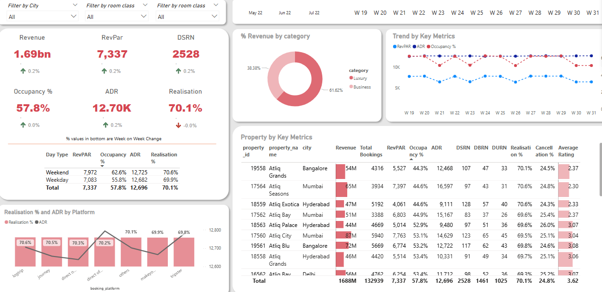

# 📊 Hotel Revenue Insights Dashboard

This repository contains my **Hotel Revenue Insights Dashboard**, a Power BI project designed to help hotel management teams track key performance metrics, analyze trends, and make data-driven decisions to maximize occupancy and revenue.

---

## ⭐ Project Overview

**Situation:**  
The hotel operations and revenue teams lacked a single source of truth for revenue, RevPAR, ADR, occupancy, and realization trends. Data was scattered across multiple reports, resulting in manual tracking and missed opportunities to optimize performance.

**Task:**  
I set out to build an interactive dashboard that centralizes revenue data, visualizes week-over-week trends, and enables easy deep dives by city, room type, and property.

**Action:**  
- Gathered and cleaned property-level revenue and occupancy data.
- Designed dynamic KPIs for Revenue, RevPAR, ADR, DSRN, and Occupancy %.
- Created interactive pie charts, trend lines, and tables to break down performance by category and property.
- Added filters for city, room class, and booking platform for flexible analysis.
- Automated data refreshes to reduce manual updates and ensure up-to-date insights.
- Focused on a clean, intuitive user experience so managers and leaders can easily explore trends and act quickly.

**Result:**  
The Hotel Revenue Insights Dashboard now provides real-time visibility into key revenue drivers, helping teams identify underperforming properties, compare booking platforms, and optimize pricing and marketing strategies. By automating the process, it saves 3–4 hours daily and turns raw data into actionable insights.

---

## ⚙️ Key Features

- 📈 **KPI Cards:** At-a-glance view of total revenue, RevPAR, ADR, DSRN, and occupancy.
- 📊 **Revenue Breakdown:** Visualize revenue split by business and luxury categories.
- 📉 **Trend Analysis:** Track week-over-week trends for RevPAR, ADR, and occupancy.
- 🏨 **Property Performance:** Detailed table with metrics like cancellation rates and average ratings.
- 🎛️ **Interactive Filters:** Drill down by city, room type, room class, and platform.
- 🔄 **Automated Data Refresh:** Keeps reports current with minimal manual work.

---

## 🗂️ Files Included

- `Hotel_Revenue_Insights_Dashboard.pbix` — Power BI dashboard file.
- `data/` — Sample dataset in Excel or CSV (if included).
- `screenshots/` — Dashboard visuals.

---

## 🖼️ Screenshots

---

## ✅ Business Impact

This project demonstrates my ability to combine clean user experience, data automation, and powerful visuals to solve real business problems and drive better decisions.

---

